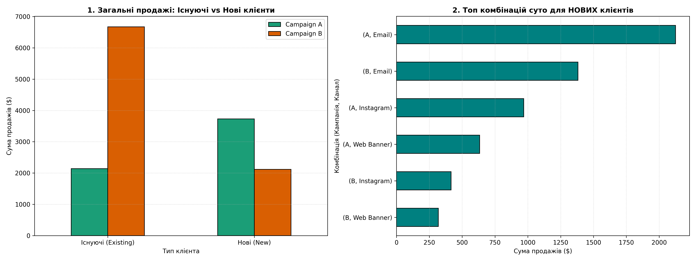

# Аналіз ефективності кампанії (BCG X Job Simulations in pandas)
## Retail Marketing Campaign Analysis 📊
> **Борд-кейс для компанії NewCo (Віртуальне стажування BCG X)**

## 📌 Огляд проєкту (Project Overview)
Цей проєкт присвячений аналізу ефективності маркетингових кампаній роздрібної компанії NewCo. Мета аналізу — дослідити результати тижневого спліт-тесту двох стратегій комунікації через різні канали та надати обґрунтовану рекомендацію щодо масштабування продажів серед **нових клієнтів**.

## 🎯 Бізнес-задача (Business Problem)
Клієнт прагне збільшити частку ринку за рахунок залучення нових покупців. Було протестовано дві концепції:
* **Campaign A (Conversational):** Неформальний, дружній тон спілкування.
* **Campaign B (Promotional):** Агресивний тон із фокусом на знижки та заклики до дії.

**Головне питання клієнта:** Яку саме комбінацію «Кампанія + Канал» варто масштабувати для максимізації продажів серед *нових* клієнтів і чому?

**Результат аналізу(EDA):**



## 🛠️ Стек технологій (Tech Stack)
Замість стандартного аналізу в Excel, проєкт повністю реалізовано на Python для автоматизації обробки даних:
* **Python**
* **Pandas** — очищення назв колонок (`.str.strip()`, `.str.lower()`), нормалізація текстових категорій та складна агрегація (`groupby`).
* **Matplotlib** — побудова комбінованих бізнес-графіків (горизонтальні та вертикальні стовпчасті діаграми).

## 🗂️ Структура репозиторію (Repository Structure)
```text
├── data/
│   └── Campaign_Data_Week1.xlsx         # Сирі дані від клієнта
├── notebooks/
│   └── marketing_analysis.ipynb         # Ноутбук із кодом очищення та візуалізації
├── presentation/
│   └── bcg_x_insights_slide.pptx        # Фінальний слайд із рекомендаціями для клієнта
└── README.md                            # Опис проєкту
